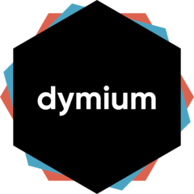

<!-- README.md is generated from README.Rmd. Please edit that file -->

```{r, include = FALSE}
knitr::opts_chunk$set(
  collapse = TRUE,
  comment = "#>",
  fig.path = "man/figures/README-",
  out.width = "100%"
)
```
# dymium 

<!-- badges: start -->
[](https://www.tidyverse.org/lifecycle/#experimental)
[](https://www.gnu.org/licenses/gpl-3.0)
[](https://travis-ci.org/dymium-org/dymium)
[
[](https://CRAN.R-project.org/package=dymium)
<!-- badges: end -->

The goal of dymium is to provide an easy-to-install and update solution for the dymium packages. If you are interested in learning about the framework and start developing your own microsimulation model using R please see [dymiumCore](https://github.com/dymium-org/dymiumCore). Some ready to use urban microsimulation modules are available at [dymiumModules](https://github.com/dymium-org/dymiumModules).

## Installation

The dymium package has not been released on CRAN, but you can install [GitHub](https://github.com/) with:

``` r
# install.packages("remotes")
remotes::install_github("dymium-org/dymium")
```

## Getting started

## A Minimal Example
This is a minimal example of a microsimulation model built with Dymium
```{r example, fig.asp=0.6, dpi=300}
library(dymium)
library(data.table)
library(R6)
set.seed(728)

head(toy_individuals)
head(toy_households)

Pop <-
  Population$new(
    ind_data = toy_individuals,
    hh_data = toy_households,
    pid_col = "pid",
    hid_col = "hid"
  )

Ind <- Pop$get("Individual")
Ind

# create a probabilistic model
driver_status_rate <- data.table(
  sex = c('male', 'female'),
  probs = list(c(0.3,0.7), c(0.4,0.6)),
  choices = list(c('can drive', 'cannot drive'), c('can drive', 'cannot drive'))
)
driver_status_rate

# create a Transition for driver status
TransitionCandrive <- R6::R6Class(
  classname = "TransitionCandrive",
  inherit = TransitionClassification
)

TransCanDrive <- TransitionCandrive$new(Ind, driver_status_rate)

barplot(
  table(TransCanDrive$get_result()[['response']]),
  main = "Transition result: driver status",
  col = c('steelblue', 'salmon')
)
```

# Credits
This repo is basically a modified version of the [Tidyverse](https://github.com/tidyverse/tidyverse) package to load the dymium packages.
