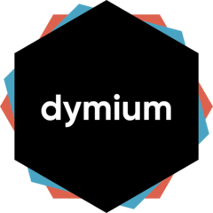

<!-- README.md is generated from README.Rmd. Please edit that file -->

# dymium 

<!-- badges: start -->

[](https://www.tidyverse.org/lifecycle/#experimental)
[](https://travis-ci.org/dymium-org/dymium)
<!-- badges: end -->

The goal of dymium is to provide an easy-to-install and update solution
for the dymium packages. If you are interested in learning about the
framework and start developing your own microsimulation model using R
please see [dymiumCore](https://github.com/dymium-org/dymiumCore). Some
ready to use urban microsimulation modules are available at
[dymiumModules](https://github.com/dymium-org/dymiumModules).

## Installation

The dymium package has not been released on CRAN, but you can install
[GitHub](https://github.com/) with:

``` r
# install.packages("remotes")
remotes::install_github("dymium-org/dymium")
```

## Getting started

## A Minimal Example

This is a minimal example of a microsimulation model built with Dymium

``` r
library(dymium)
#> + dymiumCore 0.0.10      Date: 2019-11-28
#>                                   R: 3.6.1
#>                                  OS: macOS Mojave 10.14.6
#>                                 GUI: X11
#>                                
#> 
library(data.table)
library(R6)
set.seed(728)

head(toy_individuals)
#>    pid hid age    sex marital_status partner_id father_id mother_id
#> 1:   1   1  71   male  never married         NA        NA        NA
#> 2:   2   2  31 female  never married         NA        NA        NA
#> 3:   3   2  29 female  never married         NA        NA        NA
#> 4:   4   3  38   male        married          5        NA        NA
#> 5:   5   3  25 female        married          4        NA        NA
#> 6:   6   3   0   male not applicable         NA         4         5
head(toy_households)
#>    hid did
#> 1:   1   1
#> 2:   2   2
#> 3:   3   3
#> 4:   4   4
#> 5:   5   5
#> 6:   6   6

Pop <-
  Population$new(
    ind_data = toy_individuals,
    hh_data = toy_households,
    pid_col = "pid",
    hid_col = "hid"
  )
#> [20:47:15] WARN  dymiumCore self$initialise_data: Creating `hhsize` as it is not provided with `hh_data`.
#> [20:47:15] INFO  dymiumCore self$get("Individual")$initialise_data: sets hid_col to: 'hid'

Ind <- Pop$get("Individual")
Ind
#> Class: Individual
#>  Inheritance: Individual <- Agent <- Entity <- Generic <- R6
#>  Number_of_entities: 373
#>  Number_of_removed_entities: 0
#>  Data[rows, cols]: attrs[373, 8]

# create a probabilistic model
driver_status_rate <- data.table(
  sex = c('male', 'female'),
  probs = list(c(0.3,0.7), c(0.4,0.6)),
  choices = list(c('can drive', 'cannot drive'), c('can drive', 'cannot drive'))
)
driver_status_rate
#>       sex   probs                choices
#> 1:   male 0.3,0.7 can drive,cannot drive
#> 2: female 0.4,0.6 can drive,cannot drive

# create a Transition for driver status
TransitionCandrive <- R6::R6Class(
  classname = "TransitionCandrive",
  inherit = TransitionClassification
)

TransCanDrive <- TransitionCandrive$new(Ind, driver_status_rate)

barplot(
  table(TransCanDrive$get_result()[['response']]),
  main = "Transition result: driver status",
  col = c('steelblue', 'salmon')
)
```


# Credits

This repo is basically a modified version of the
[Tidyverse](https://github.com/tidyverse/tidyverse) package to load the
dymium packages.
